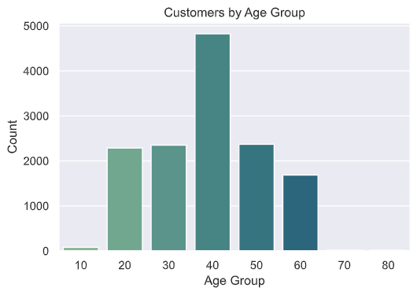
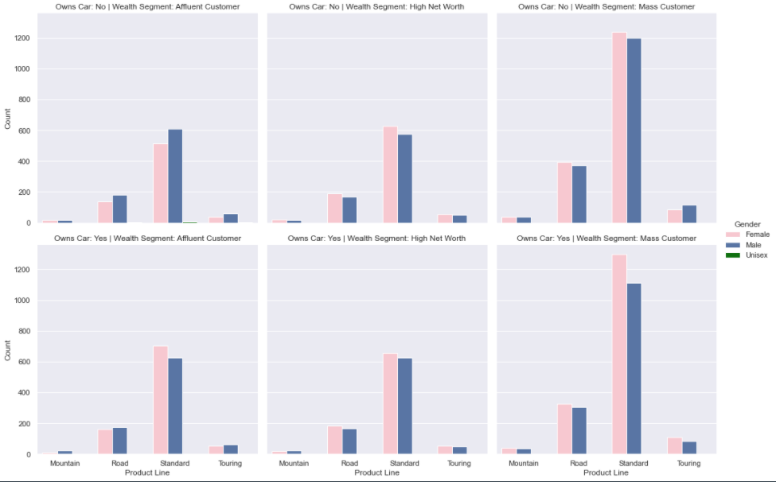
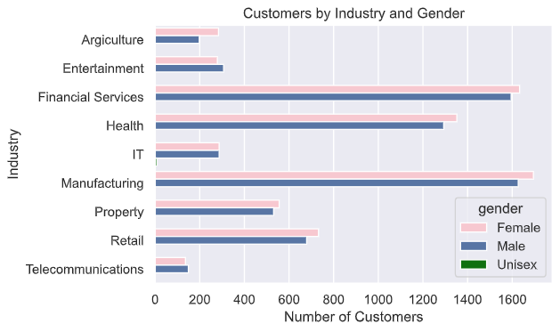
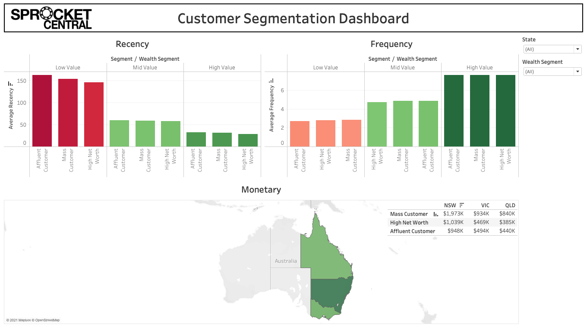

# Customer Analytics and Segmentation

## Project Overview

- Data Quality Assessment
  - Performed data cleaning and validation on all four customer datasets
- Data Insights
  - EDA on customer datasets 
  - Most customers belong to the mass customer segment and are in their 40s
  - More customers are in the manufacturing, financial services, and health industries
  - New South Wales inhabits the majority of customers
  - Conducted recency, frequency, and monetary (RFM) analysis using KMeans clustering to find most valuable customers
- Data Insights and Presentation
  - Created a dashboard displaying key customer groups with their recency, frequency, and monetary value towards the business

The link to the virtual experience program can be found [here](https://www.theforage.com/virtual-internships/theme/m7W4GMqeT3bh9Nb2c/KPMG-Data-Analytics-Virtual-Internship?ref=ssXd9eS4vMaefNQb5).

## Code and Resources Used

Python version: 3.8.3

Packages: pandas, matplotlib, seaborn

RFM analysis in Python: https://towardsdatascience.com/data-driven-growth-with-python-part-2-customer-segmentation-5c019d150444

## Data Quality Assessment

Numerous errors were found throughout the cleaning process, among them are:

- Missing values
- Unnamed columns
- Inconsistent values

More details can be found in the folder Tasks -> KPMG Virtual Internship - Data Quality Assessment - Task 1

## Data Insights

Here are a few insights found throughout the exploratory data analysis process.

## Data Insights and Presentation

The final dashboard is shown below and can be downloaded in Tasks -> KPMG Virtual Internship - Data Insights and Presentation - Task 3.

*Note: You will need to have Tableau Desktop installed in order to view the dashboard and play around with it.*

